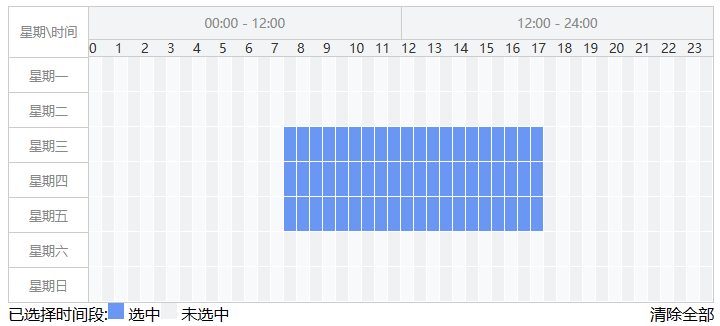
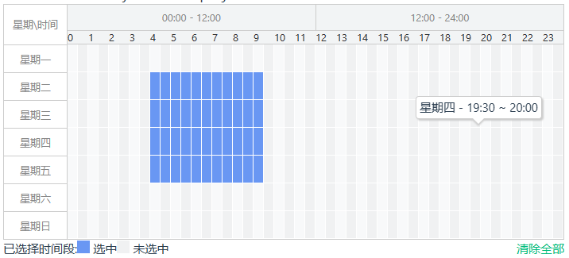

```js
usage
npm install week-calender

import {WeekCalender, WeekCalenderGrid} from 'weekCalender'
import 'week-calender/dist/index.css'

app.component(weekCalender.name, weekCalender)
app.component(WeekCalenderGrid.name, WeekCalenderGrid)

then use in template or jsx or some way you like
<week-calender v-model:value='' />
```

```js
<script src="./dist/week-calender.umd.cjs"></script>

components: {
 ...WeekCalender
}

then use in template or jsx or some way you like
<week-calender v-model:value='' />
```

|  props   |  type  | required |
| :------: | :----: | :------: |
|  value   | string | partial  |
| disabled | string | partial  |

|    event     |          type           |
| :----------: | :---------------------: |
| update:value | (value: string) => void |
|    change    | (value: string) => void |

value is 48\*7 length which contains 0 | 1

1 represent selected
0 represent unselected

basic function
mouse event to select week period, tooltip with every half hour



